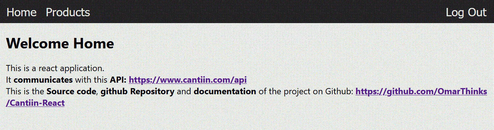
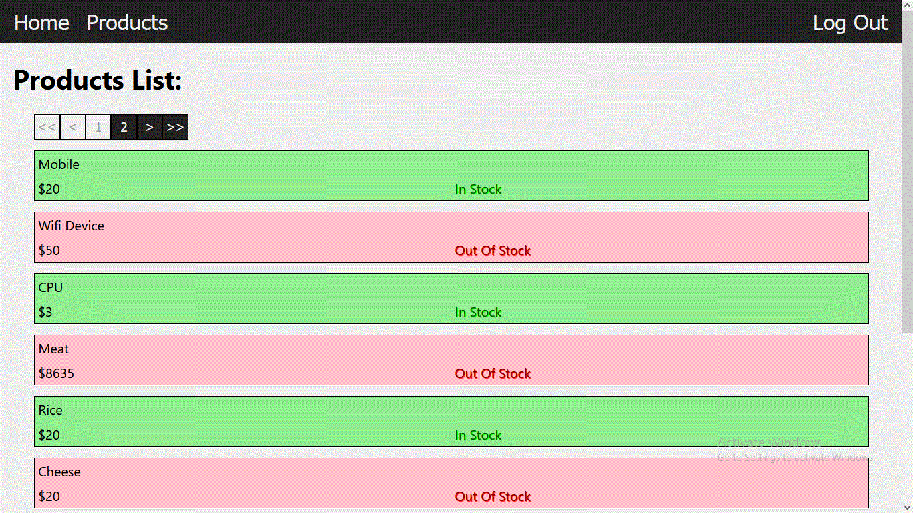

# Cantiin-React
Creating a React frontend to Cantiin.com

# A) Links:

<table>
<tr>
<th>Description</th>
<th>Link</th>
</tr>
<tr>
<td>Deployed on <b>AWS Amplify</b></td>
<td>
<a href="https://cantiin.d3thsty4rzma1i.amplifyapp.com" >https://cantiin.d3thsty4rzma1i.amplifyapp.com</a>
</td>
</tr>
<tr>
<td>Github Repository <b>(Source Code and Documentation)</b></td>
<td>
<a href="https://github.com/OmarThinks/Cantiin-React" >https://github.com/OmarThinks/Cantiin-React</a>
</td>
</tr>
<tr>
<td>RESTful API <b>Backend</b> (That this react app communicates with)</td>
<td>
<a href="https://cantiin.com/api/" >https://cantiin.com/api/</a>
</td>
</tr>

</table>

# B) About:

This is a React Frontend that Communicates with a RESTful API that I have created using Django REST Framework.  
Here is the link of the Backend API: https://cantiin.com/api.  

# C) Technologies Used:

<b>

1. HTML
2. CSS
3. JavaScript
4. React
5. Testing
6. Axios
7. AWS Amplify

</b>

# D) Routes:

## D-1) /

This is the home directory.

## D-2) /products

This is the page when the products are loading:

This is the first page of the products:

This is the second page:

# E) Backend:

